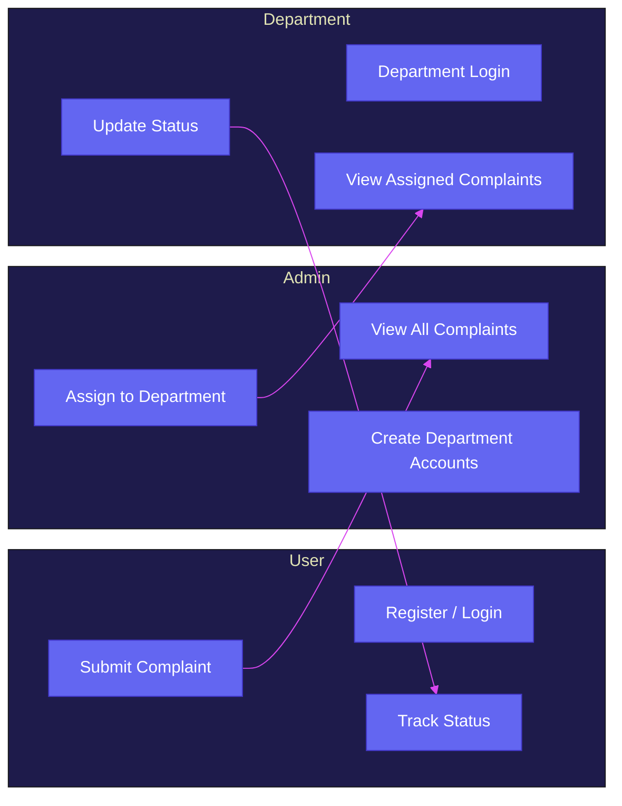
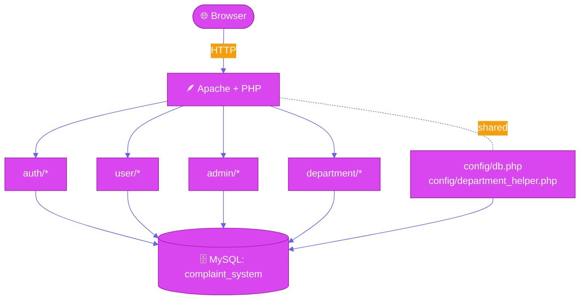
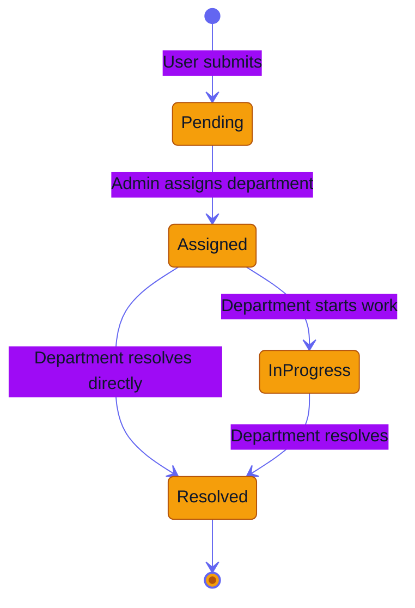
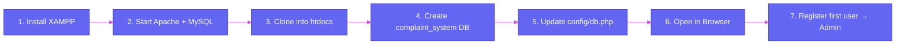

<!-- ============== HERO BANNER ============== -->
<a href="#">
  
</a>

<div align="center">

<a href="#">
  
</a>

<br/>

<p>
  
  
  
  
</p>

<p>
  
  
  
  
  
</p>

<a href="#-quick-start-xampp">
  
</a>
<a href="#-feature-set">
  
</a>
<a href="#-system-architecture">
  
</a>

</div>


## Table of Contents

- [About](#-about)
- [Highlights](#-highlights)
- [Tech Stack](#%EF%B8%8F-tech-stack)
- [Feature Set](#-feature-set)
- [Roles & Capabilities](#-roles--capabilities)
- [System Architecture](#-system-architecture)
- [Complaint Lifecycle](#-complaint-lifecycle)
- [Pages and Routes](#-pages-and-routes)
- [Quick Start (XAMPP)](#-quick-start-xampp)
- [Database Setup](#-database-setup)
- [Project Structure](#-project-structure)
- [Security Notes](#-security-notes)
- [Screenshots](#-screenshots)
- [Troubleshooting](#-troubleshooting)
- [Roadmap](#%EF%B8%8F-roadmap)
- [Contributing](#-contributing)


## About

> A clean, role-based **complaint management web app** built with **PHP + MySQL**.
> Three personas, three dashboards, one smooth pipeline: **submit → assign → resolve**.

| | |
|---|---|
| **What it does** | Lets users file complaints, admins route them to departments, departments resolve them |
| **Who it's for** | Internships, college mini-projects, internal tools, learning role-based PHP apps |
| **Why it's nice** | Sessions + hashed passwords, prepared statements everywhere, responsive UI, zero JS framework lock-in |

> [!TIP]
> The **first registered account** is auto-promoted to **Admin**. Sign up first to bootstrap the system.


## Highlights

<table>
<tr>
<td width="50%" valign="top">

### Designed for clarity
- Three role-scoped dashboards
- Color-coded status badges
- Mobile-friendly stacked tables
- Toast feedback on auth flows

</td>
<td width="50%" valign="top">

### Built with care
- Prepared statements end-to-end
- `password_hash()` + `password_verify()`
- `session_regenerate_id()` after login
- Allow-listed status transitions

</td>
</tr>
<tr>
<td width="50%" valign="top">

### Drop-in friendly
- Single `config/db.php` to edit
- First user auto-becomes Admin
- Schema auto-detection for legacy DBs
- Works on any LAMP/XAMPP/WAMP stack

</td>
<td width="50%" valign="top">

### Easy to extend
- Clear folder-per-role layout
- Tiny, dependency-free codebase
- Helper module for department linking
- Roadmap for CSRF, pagination, email

</td>
</tr>
</table>


## Tech Stack

<div align="center">

<table>
  <tr>
    <td align="center" width="110">
      <br />
      <sub><b>PHP 8.x</b></sub>
    </td>
    <td align="center" width="110">
      <br />
      <sub><b>MySQL 8.x</b></sub>
    </td>
    <td align="center" width="110">
      <br />
      <sub><b>HTML5</b></sub>
    </td>
    <td align="center" width="110">
      <br />
      <sub><b>CSS3</b></sub>
    </td>
    <td align="center" width="110">
      <br />
      <sub><b>JavaScript</b></sub>
    </td>
    <td align="center" width="110">
      <br />
      <sub><b>Apache</b></sub>
    </td>
  </tr>
</table>

</div>


## Feature Set

<details open>
<summary><b>🔐 Authentication & Accounts</b></summary>
<br/>

- Email + password registration with length / format / confirm validation
- Passwords hashed with `password_hash(PASSWORD_DEFAULT)`
- Login uses `password_verify()` and regenerates the session ID
- One login endpoint, three branches: **admin**, **user**, **department**
- Department accounts blocked from `login.php`; they must use `department/login.php`
- First registered user is auto-promoted to **Admin**
- Clean session destruction at `auth/logout.php`

</details>

<details open>
<summary><b>👤 User Workflow</b></summary>
<br/>

- Personal dashboard with **only your** complaints
- Submit a complaint with **title** + **description**
- Detail view per complaint with status, description, and timestamp
- Color-coded status badges: `Pending`, `Assigned`, `In Progress`, `Resolved`

</details>

<details open>
<summary><b>🛡️ Admin Workflow</b></summary>
<br/>

- Master dashboard joining complaints with users and departments
- Department directory section (name + linked email)
- Create department accounts in a single transactional flow (`users` + `departments`)
- Assign complaints; status flips to `Assigned` automatically
- Resolved rows render a "Completed" indicator instead of an action
- Flash messages for success / failure

</details>

<details open>
<summary><b>🏢 Department Workflow</b></summary>
<br/>

- Dedicated portal at `department/login.php`
- Dashboard scoped to **only complaints assigned to that department**
- Update status to `In Progress` or `Resolved`
- Allow-list validation + ownership check on every update

</details>

<details>
<summary><b>🛡️ Security & Hardening</b></summary>
<br/>

- All SQL is parameterized (`mysqli` `prepare` + `bind_param`)
- Output escaped via `htmlspecialchars()` to prevent XSS
- `session_regenerate_id(true)` after successful login
- Strict `REQUEST_METHOD` checks on every processor
- Allow-listed statuses; no free-form status writes
- Department actions verify `department_id` matches the logged-in account

</details>


## Roles & Capabilities



| Role | Can Do |
|---|---|
| 👤 **User** | Register, log in, submit complaints, view own complaints, track status |
| 🛡️ **Admin** | View every complaint, create department accounts, assign complaints |
| 🏢 **Department** | Log in via portal, view assigned complaints, mark **In Progress** or **Resolved** |


## System Architecture



**Key modules**

- `config/db.php` — single `mysqli` connection
- `config/department_helper.php` — auto-detects `departments.user_id` and resolves the department for a logged-in dept user
- `auth/` — registration, login, logout endpoints
- `user/`, `admin/`, `department/` — per-role pages and processors
- `assets/css/` — styles for admin/assign/view screens


## Complaint Lifecycle



| Status | Color | Set By | Where |
|---|---|---|---|
| 🟠 **Pending** | Amber | System (default) | `user/add_complaint_process.php` |
| 🟣 **Assigned** | Magenta | Admin | `admin/assign_department.php` |
| ◦ **In Progress** | Indigo | Department | `department/update_status_process.php` |
| ○ **Resolved** | Emerald | Department | `department/update_status_process.php` |


## Pages and Routes

| Purpose | Method | Path |
|---|---|---|
| Login (Admin / User) | `GET` | `login.php` |
| Register | `GET` | `register.php` |
| Login processor | `POST` | `auth/login_process.php` |
| Register processor | `POST` | `auth/register_process.php` |
| Logout | `GET` | `auth/logout.php` |
| User dashboard | `GET` | `user/dashboard.php` |
| Add complaint | `GET` | `user/add_complaint.php` |
| Add complaint processor | `POST` | `user/add_complaint_process.php` |
| View complaint | `GET` | `user/view_complaint.php?id={id}` |
| Admin dashboard | `GET` | `admin/dashboard.php` |
| Create department | `GET` | `admin/create_department.php` |
| Create department processor | `POST` | `admin/create_department_process.php` |
| Assign complaint | `GET` | `admin/assign.php?id={id}` |
| Assign processor | `POST` | `admin/assign_department.php` |
| Department login | `GET` | `department/login.php` |
| Department dashboard | `GET` | `department/dashboard.php` |
| Update status | `GET` | `department/update_status.php?id={id}` |
| Update status processor | `POST` | `department/update_status_process.php` |


## Quick Start (XAMPP)

> [!NOTE]
> Steps assume Windows + XAMPP. macOS/Linux users — adjust the `htdocs` path accordingly.



```bash
# 1. Clone into your web root
git clone https://github.com/jagratsati45/complaint_system_project.git "C:/xampp/htdocs/complaint-system"

# 2. Open in browser
start http://localhost/complaint-system/login.php
```

> [!TIP]
> Forgot to make yourself admin? Run:
> ```sql
> UPDATE users SET role='admin' WHERE email='you@example.com';
> ```


## Database Setup

### Connection

`config/db.php` returns a single `mysqli` connection. Update host / user / password / db name as needed:

```php
$conn = mysqli_connect("localhost", "root", "", "complaint_system");
```

### Baseline schema

```sql
CREATE DATABASE IF NOT EXISTS complaint_system;
USE complaint_system;

CREATE TABLE IF NOT EXISTS users (
  id INT AUTO_INCREMENT PRIMARY KEY,
  name VARCHAR(100) NOT NULL,
  email VARCHAR(150) NOT NULL UNIQUE,
  password VARCHAR(255) NOT NULL,
  role ENUM('admin','user','department') NOT NULL DEFAULT 'user'
);

CREATE TABLE IF NOT EXISTS departments (
  id INT AUTO_INCREMENT PRIMARY KEY,
  name VARCHAR(100) NOT NULL UNIQUE,
  user_id INT NULL
);

CREATE TABLE IF NOT EXISTS complaints (
  id INT AUTO_INCREMENT PRIMARY KEY,
  user_id INT NOT NULL,
  department_id INT NULL,
  title VARCHAR(200) NOT NULL,
  description TEXT NOT NULL,
  status VARCHAR(30) NOT NULL DEFAULT 'Pending',
  created_at TIMESTAMP NOT NULL DEFAULT CURRENT_TIMESTAMP
);
```

### Department linking modes

| Mode | Trigger | Resolved By |
|---|---|---|
| **By `user_id`** | If `departments.user_id` exists | `WHERE departments.user_id = ?` |
| **By `name`** *(legacy)* | If the column is missing | `WHERE departments.name = users.name` |

Handled inside `config/department_helper.php` — existing installs keep working without migration.


## Project Structure

```text
complaint_system_project/
├─ admin/
│  ├─ assign.php                      # Pick a department for a complaint
│  ├─ assign_department.php           # POST handler that assigns + flips status
│  ├─ create_department.php           # Form to create a department account
│  ├─ create_department_process.php   # Transactional user + department insert
│  └─ dashboard.php                   # Admin overview of complaints + departments
├─ assets/css/
│  ├─ admin.css
│  ├─ assign.css
│  └─ view.css
├─ auth/
│  ├─ login_process.php               # Validates creds, sets session, branches by role
│  ├─ logout.php                      # Destroys session
│  └─ register_process.php            # Creates user; first user becomes admin
├─ config/
│  ├─ db.php                          # mysqli connection
│  └─ department_helper.php           # Department <-> user linking helpers
├─ department/
│  ├─ dashboard.php                   # Lists complaints for the department
│  ├─ login.php                       # Department-only login page
│  ├─ update_status.php               # Status update form
│  └─ update_status_process.php       # POST handler with allow-listed statuses
├─ user/
│  ├─ add_complaint.php               # Form to submit a complaint
│  ├─ add_complaint_process.php       # POST handler
│  ├─ dashboard.php                   # User's own complaint list
│  ├─ get_user_complaints.php         # Helper query
│  └─ view_complaint.php              # Complaint detail view
├─ login.php                          # Main login page
├─ register.php                       # Registration page
└─ README.md
```


## Security Notes

| Concern | Mitigation |
|---|---|
| **SQL Injection** | Prepared statements + `bind_param` everywhere |
| **XSS** | Output via `htmlspecialchars()` in every PHP view |
| **Password storage** | `password_hash()` (`PASSWORD_DEFAULT`) + `password_verify()` |
| **Session fixation** | `session_regenerate_id(true)` on login |
| **Method confusion** | Every processor checks `$_SERVER['REQUEST_METHOD']` |
| **Privilege escalation** | Each page checks `$_SESSION['role']` and redirects on mismatch |
| **Status tampering** | Status updates restricted to an allow-listed array |
| **Cross-account access** | Department updates require both `complaint_id` *and* matching `department_id` |

> [!WARNING]
> Built for **learning + local development**. Add HTTPS, CSRF tokens, rate limiting, and stronger validation before deploying publicly.


## Screenshots

> Drop captures into `docs/screenshots/` and reference them here:

| Screen | Path |
|---|---|
| Login | `docs/screenshots/login.png` |
| Register | `docs/screenshots/register.png` |
| User dashboard | `docs/screenshots/user-dashboard.png` |
| Add complaint | `docs/screenshots/add-complaint.png` |
| Admin dashboard | `docs/screenshots/admin-dashboard.png` |
| Create department | `docs/screenshots/create-department.png` |
| Assign complaint | `docs/screenshots/assign.png` |
| Department dashboard | `docs/screenshots/department-dashboard.png` |


## Troubleshooting

<details>
<summary><b>🔧 Department login shows <code>department_not_linked</code></b></summary>
<br/>

The department user exists, but no row in `departments` matches it.

- Sign in as Admin and create the department via `admin/create_department.php`, **or**
- If using legacy linking, ensure `departments.name` matches the department user's `name` exactly.

</details>

<details>
<summary><b>🔧 "use_department_login" message on <code>login.php</code></b></summary>
<br/>

You tried to log in as a department account from the main login. Department accounts must use `department/login.php`.

</details>

<details>
<summary><b>🔧 Database connection failed</b></summary>
<br/>

- Confirm MySQL is running in XAMPP
- Check credentials in `config/db.php`
- Ensure the database `complaint_system` exists and the schema is loaded

</details>

<details>
<summary><b>🔧 First user is not Admin</b></summary>
<br/>

Auto-promotion only fires when `users` has zero admins. To fix manually:

```sql
UPDATE users SET role='admin' WHERE email='you@example.com';
```

</details>

<details>
<summary><b>🔧 "This email is already registered" while creating a department</b></summary>
<br/>

The email is already in `users`. Use a different email or remove the conflicting row.

</details>


## Roadmap

- [ ] CSRF tokens on all POST forms
- [ ] Pagination & search on dashboards
- [ ] Email notifications on assignment / resolution
- [ ] File attachments on complaints
- [ ] Audit log of status changes
- [ ] Admin-side analytics (counts by status / department)
- [ ] Dockerfile + `docker-compose` for one-command setup


## Contributing

1. Fork the repo
2. Create a branch — `git checkout -b feature/your-feature`
3. Commit — `git commit -m "feat: add your feature"`
4. Push — `git push origin feature/your-feature`
5. Open a Pull Request

For larger changes, open an issue first to discuss the direction.


<div align="center">
<sub>Crafted with PHP, MySQL, and a lot of <code>console.log()</code>.<br/>If this helped you, drop a · on the repo.</sub>
</div>
