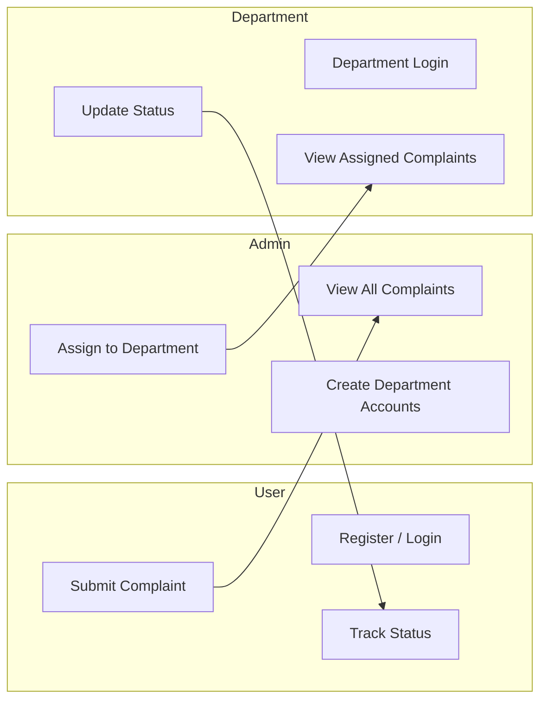
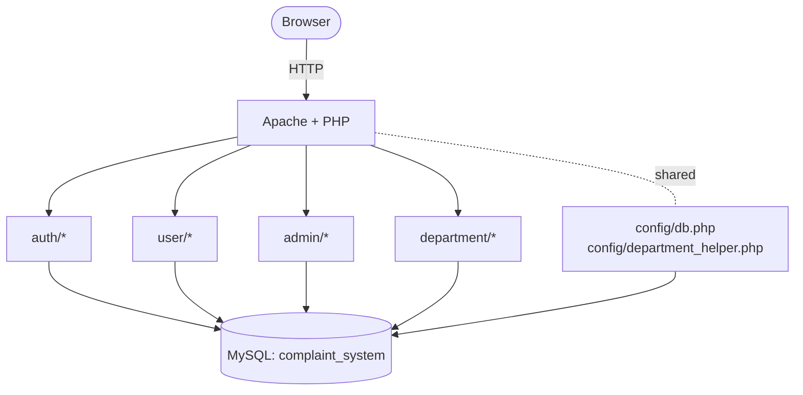
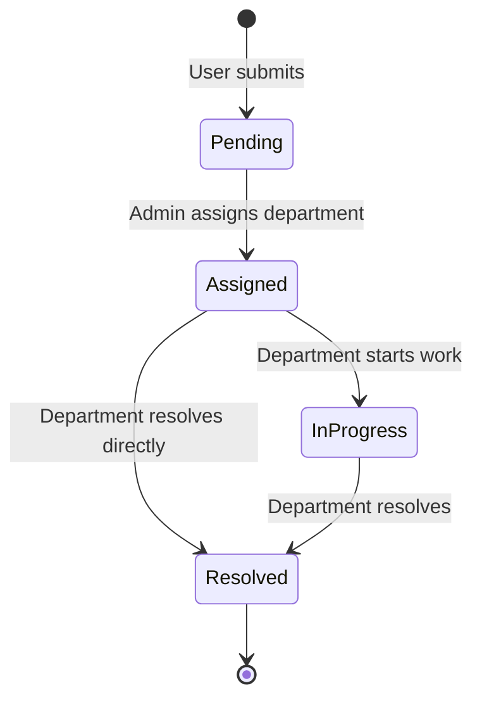
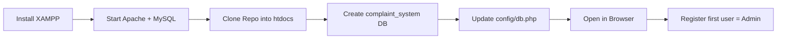

<div align="center">


# Complaint Management System

### A role-based complaint tracking web application built with **PHP + MySQL**

<p>
  
  
  
  
  
  
</p>

<p>
  
  
  
  
  
</p>

<p><i>Submit complaints. Route to departments. Resolve them faster.</i></p>

</div>

---

## Table of Contents

- [About the Project](#about-the-project)
- [Highlights](#highlights)
- [Tech Stack](#tech-stack)
- [Feature Set](#feature-set)
- [Roles & Capabilities](#roles--capabilities)
- [System Architecture](#system-architecture)
- [Complaint Lifecycle](#complaint-lifecycle)
- [Pages and Routes](#pages-and-routes)
- [Quick Start (XAMPP)](#quick-start-xampp)
- [Database Setup](#database-setup)
- [Project Structure](#project-structure)
- [Security Notes](#security-notes)
- [Screenshots](#screenshots)
- [Troubleshooting](#troubleshooting)
- [Roadmap](#roadmap)
- [Contributing](#contributing)
- [License](#license)

---

## About the Project

> The **Complaint Management System** is a lightweight web application that streamlines how complaints are filed, assigned, and resolved inside an organization.

It supports three distinct roles — **Admin**, **User**, and **Department** — with separate dashboards and access rules. Users raise complaints, the admin routes them to the appropriate department, and the department updates the resolution status. Every interaction is protected by sessions and hashed passwords.

> [!TIP]
> The **first registered account** is automatically promoted to **Admin**. Use that account to bootstrap the system.

---

## Highlights

| | |
|---|---|
| **Role-based access** | Admin, User, and Department dashboards with strict session checks |
| **First-admin bootstrap** | First sign-up is auto-promoted to Admin to get you started fast |
| **Toast notifications** | Inline feedback on login & registration without page reloads |
| **Prepared statements** | Parameterized SQL queries throughout to defend against SQL injection |
| **Session hardening** | `session_regenerate_id()` after login to prevent session fixation |
| **Backward-compatible schema** | Auto-detects whether `departments.user_id` exists and adapts |
| **Responsive UI** | Mobile-friendly tables with `data-label` attributes for stacked views |
| **Flash messaging** | Admin actions surface success/error notices via session flashes |

---

## Tech Stack

<table>
  <tr>
    <td align="center" width="120"><br /><sub><b>PHP 8.x</b></sub></td>
    <td align="center" width="120"><br /><sub><b>MySQL 8.x</b></sub></td>
    <td align="center" width="120"><br /><sub><b>HTML5</b></sub></td>
    <td align="center" width="120"><br /><sub><b>CSS3</b></sub></td>
    <td align="center" width="120"><br /><sub><b>JavaScript</b></sub></td>
    <td align="center" width="120"><br /><sub><b>XAMPP</b></sub></td>
  </tr>
</table>

- **Server-side:** PHP with `mysqli` and prepared statements
- **Database:** MySQL — three core tables (`users`, `departments`, `complaints`)
- **Frontend:** Vanilla HTML, CSS, and JavaScript with `fetch()` for async auth
- **Local stack:** XAMPP (Apache + MySQL) recommended

---

## Feature Set

<details open>
<summary><b>Authentication & Accounts</b></summary>

- Email + password registration with validation (length, format, confirm match)
- Passwords are hashed with `password_hash()` (`PASSWORD_DEFAULT`)
- Login validates with `password_verify()` and regenerates the session ID
- Three login flows from one endpoint: **admin**, **user**, and **department**
- Department accounts must log in via `department/login.php`; general login blocks them
- Auto-promotes the very first registered user to **Admin**
- Logout destroys the session cleanly via `auth/logout.php`

</details>

<details open>
<summary><b>User Workflow</b></summary>

- Personal dashboard listing only the logged-in user's complaints
- Submit a complaint with **title** + **description**
- View full complaint detail page (status, description, created-at)
- Status badges (`Pending`, `Assigned`, `In Progress`, `Resolved`)

</details>

<details open>
<summary><b>Admin Workflow</b></summary>

- Dashboard showing **all complaints** joined with users and departments
- Department directory section listing every department + linked email
- Create department accounts (creates a `users` row + `departments` row in one transaction)
- Assign any complaint to a department; status flips to `Assigned`
- Resolved complaints display a "Completed" indicator instead of an action
- Flash messages for success/failure on admin actions

</details>

<details open>
<summary><b>Department Workflow</b></summary>

- Dedicated login page at `department/login.php`
- Dashboard scoped to **only complaints assigned to that department**
- Update status to either `In Progress` or `Resolved`
- Status updates are guarded by allow-listed values + ownership checks

</details>

<details>
<summary><b>Security & Hardening</b></summary>

- All SQL uses **prepared statements** (`mysqli` `prepare` + `bind_param`)
- Output is escaped with `htmlspecialchars()` to prevent XSS
- `session_regenerate_id(true)` after successful login
- Strict `REQUEST_METHOD` checks on every form processor
- Allow-list validation for status updates (`In Progress`, `Resolved`)
- Department actions verify `department_id` matches the logged-in account

</details>

---

## Roles & Capabilities



| Role | Can Do |
|---|---|
| **User** | Register, log in, submit complaints, view own complaints, track status |
| **Admin** | View every complaint, create department accounts, assign complaints to departments |
| **Department** | Log in via department portal, view assigned complaints, mark **In Progress** or **Resolved** |

---

## System Architecture



**Key modules**

- `config/db.php` — single MySQL connection returned for `require`-style use
- `config/department_helper.php` — detects whether `departments.user_id` exists and resolves the department for a logged-in department user
- `auth/` — registration, login, and logout endpoints
- `user/`, `admin/`, `department/` — per-role pages and processors
- `assets/css/` — shared styles for admin/assign/view screens

---

## Complaint Lifecycle



| Status | Set By | Where |
|---|---|---|
| **Pending** | System (default on insert) | `user/add_complaint_process.php` |
| **Assigned** | Admin | `admin/assign_department.php` |
| **In Progress** | Department | `department/update_status_process.php` |
| **Resolved** | Department | `department/update_status_process.php` |

---

## Pages and Routes

| Purpose | Method | Path |
|---|---|---|
| Login (Admin / User) | `GET` | `login.php` |
| Register | `GET` | `register.php` |
| Login processor | `POST` | `auth/login_process.php` |
| Register processor | `POST` | `auth/register_process.php` |
| Logout | `GET` | `auth/logout.php` |
| User dashboard | `GET` | `user/dashboard.php` |
| Add complaint | `GET` | `user/add_complaint.php` |
| Add complaint processor | `POST` | `user/add_complaint_process.php` |
| View complaint | `GET` | `user/view_complaint.php?id={id}` |
| Admin dashboard | `GET` | `admin/dashboard.php` |
| Create department | `GET` | `admin/create_department.php` |
| Create department processor | `POST` | `admin/create_department_process.php` |
| Assign complaint | `GET` | `admin/assign.php?id={id}` |
| Assign processor | `POST` | `admin/assign_department.php` |
| Department login | `GET` | `department/login.php` |
| Department dashboard | `GET` | `department/dashboard.php` |
| Update status | `GET` | `department/update_status.php?id={id}` |
| Update status processor | `POST` | `department/update_status_process.php` |

---

## Quick Start (XAMPP)

> [!NOTE]
> The steps below assume Windows + XAMPP. The same flow works on macOS/Linux — just adjust the `htdocs` path.



1. **Install XAMPP** and start **Apache** + **MySQL** from the control panel.
2. **Clone the repo** into your web root:
   ```bash
   git clone https://github.com/jagratsati45/complaint_system_project.git "C:/xampp/htdocs/complaint-system"
   ```
3. **Create the database** named `complaint_system` (see [Database Setup](#database-setup)).
4. **Update credentials** in `config/db.php` if your MySQL user/password differs from the defaults.
5. **Open the app** in your browser:
   - <http://localhost/complaint-system/login.php>
6. **Register** the first account — it becomes the **Admin** automatically.

---

## Database Setup

### Connection

`config/db.php` returns a single `mysqli` connection. Update host/user/password/db name as needed:

```php
$conn = mysqli_connect("localhost", "root", "", "complaint_system");
```

### Baseline schema

```sql
CREATE DATABASE IF NOT EXISTS complaint_system;
USE complaint_system;

CREATE TABLE IF NOT EXISTS users (
  id INT AUTO_INCREMENT PRIMARY KEY,
  name VARCHAR(100) NOT NULL,
  email VARCHAR(150) NOT NULL UNIQUE,
  password VARCHAR(255) NOT NULL,
  role ENUM('admin','user','department') NOT NULL DEFAULT 'user'
);

CREATE TABLE IF NOT EXISTS departments (
  id INT AUTO_INCREMENT PRIMARY KEY,
  name VARCHAR(100) NOT NULL UNIQUE,
  user_id INT NULL
);

CREATE TABLE IF NOT EXISTS complaints (
  id INT AUTO_INCREMENT PRIMARY KEY,
  user_id INT NOT NULL,
  department_id INT NULL,
  title VARCHAR(200) NOT NULL,
  description TEXT NOT NULL,
  status VARCHAR(30) NOT NULL DEFAULT 'Pending',
  created_at TIMESTAMP NOT NULL DEFAULT CURRENT_TIMESTAMP
);
```

### Department linking modes

The app auto-detects how departments are linked to users:

| Mode | Trigger | Resolved By |
|---|---|---|
| **By `user_id`** | If `departments.user_id` column exists | `WHERE departments.user_id = ?` |
| **By `name`** (legacy) | If the column is missing | `WHERE departments.name = users.name` |

This is handled inside `config/department_helper.php`, so existing installs keep working without a migration.

---

## Project Structure

```text
complaint_system_project/
├─ admin/
│  ├─ assign.php                      # Pick a department for a complaint
│  ├─ assign_department.php           # POST handler that assigns + flips status
│  ├─ create_department.php           # Form to create a department account
│  ├─ create_department_process.php   # Transactional user + department insert
│  └─ dashboard.php                   # Admin overview of complaints + departments
├─ assets/
│  └─ css/
│     ├─ admin.css
│     ├─ assign.css
│     └─ view.css
├─ auth/
│  ├─ login_process.php               # Validates creds, sets session, branches by role
│  ├─ logout.php                      # Destroys session
│  └─ register_process.php            # Creates user; first user becomes admin
├─ config/
│  ├─ db.php                          # mysqli connection
│  └─ department_helper.php           # Department <-> user linking helpers
├─ department/
│  ├─ dashboard.php                   # Lists complaints for the department
│  ├─ login.php                       # Department-only login page
│  ├─ update_status.php               # Status update form
│  └─ update_status_process.php       # POST handler with allow-listed statuses
├─ user/
│  ├─ add.css
│  ├─ add_complaint.php               # Form to submit a complaint
│  ├─ add_complaint_process.php       # POST handler
│  ├─ dashboard.css
│  ├─ dashboard.php                   # User's own complaint list
│  ├─ get_user_complaints.php         # Helper query
│  └─ view_complaint.php              # Complaint detail view
├─ login.php                          # Main login page
├─ login.css
├─ register.php                       # Registration page
├─ register.css
└─ README.md
```

---

## Security Notes

| Concern | Mitigation |
|---|---|
| **SQL Injection** | All queries use `mysqli` prepared statements with `bind_param` |
| **XSS** | Output rendered through `htmlspecialchars()` in every PHP view |
| **Password storage** | `password_hash()` with `PASSWORD_DEFAULT` and `password_verify()` |
| **Session fixation** | `session_regenerate_id(true)` on successful login |
| **Method confusion** | Every processor checks `$_SERVER['REQUEST_METHOD']` |
| **Privilege escalation** | Each page checks `$_SESSION['role']` and redirects on mismatch |
| **Status tampering** | Status updates restricted to an allow-listed array |
| **Cross-account access** | Department updates require both `complaint_id` *and* matching `department_id` |

> [!WARNING]
> This project is intended for **learning and local development**. Before deploying anywhere public, add HTTPS, CSRF tokens, rate limiting, and stronger input validation.

---

## Screenshots

> Drop screenshots into a `docs/screenshots/` folder and reference them here. Suggested captures:

| Screen | File |
|---|---|
| Login (Admin/User) | `docs/screenshots/login.png` |
| Register | `docs/screenshots/register.png` |
| User dashboard | `docs/screenshots/user-dashboard.png` |
| Add complaint | `docs/screenshots/add-complaint.png` |
| Admin dashboard | `docs/screenshots/admin-dashboard.png` |
| Create department | `docs/screenshots/create-department.png` |
| Assign complaint | `docs/screenshots/assign.png` |
| Department dashboard | `docs/screenshots/department-dashboard.png` |

---

## Troubleshooting

<details>
  <summary><b>Department login shows <code>department_not_linked</code></b></summary>

The department user exists but no row in `departments` matches it.

- Sign in as Admin and create the department via `admin/create_department.php`.
- Or, if using legacy linking, ensure the `departments.name` matches the department user's `name` exactly.
</details>

<details>
  <summary><b>"use_department_login" message on the main login page</b></summary>

You tried to log in as a department account from `login.php`. Department accounts must use `department/login.php`.
</details>

<details>
  <summary><b>Database connection failed</b></summary>

- Confirm MySQL is running in XAMPP.
- Check credentials in `config/db.php`.
- Ensure the database `complaint_system` exists and the schema is loaded.
</details>

<details>
  <summary><b>First user is not Admin</b></summary>

Auto-promotion only happens when the `users` table has zero admins. If a previous run already created one, register a new account *after* clearing existing admins, or set the role manually via SQL:

```sql
UPDATE users SET role='admin' WHERE email='you@example.com';
```
</details>

<details>
  <summary><b>"This email is already registered" when creating a department</b></summary>

The email is already taken in the `users` table. Use a different email or remove the conflicting row.
</details>

---

## Roadmap

- [ ] CSRF tokens on all POST forms
- [ ] Pagination & search on dashboards
- [ ] Email notifications on assignment / resolution
- [ ] File attachments on complaints
- [ ] Audit log of status changes
- [ ] Admin-side analytics (counts by status / department)
- [ ] Dockerfile + `docker-compose` for one-command setup

---

## Contributing

Contributions are welcome and appreciated! To propose a change:

1. Fork the repo
2. Create a branch: `git checkout -b feature/your-feature`
3. Commit your changes: `git commit -m "feat: add your feature"`
4. Push the branch: `git push origin feature/your-feature`
5. Open a Pull Request

For larger changes, please open an issue first to discuss what you'd like to change.

---

## License

This project is released for educational and personal use. Add a `LICENSE` file (e.g. MIT) if you plan to distribute it.

---

<div align="center">

<sub>Built with PHP, MySQL, and a lot of debugging.<br/>If this project helped you, consider giving the repo a ·.</sub>

</div>
